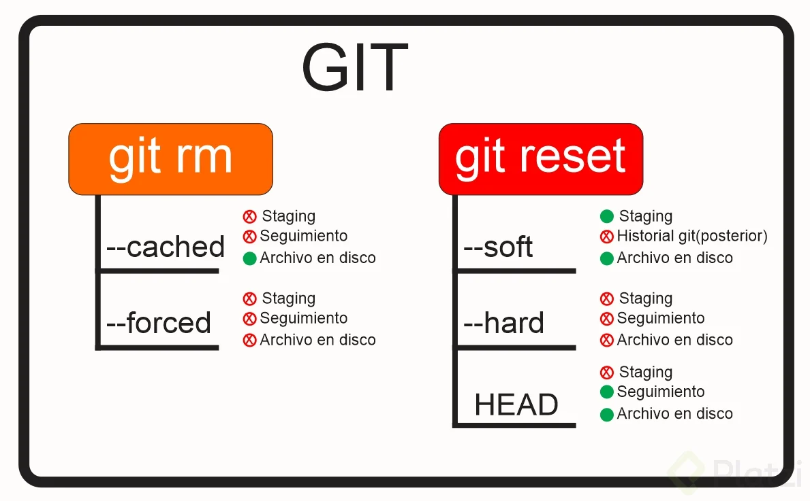
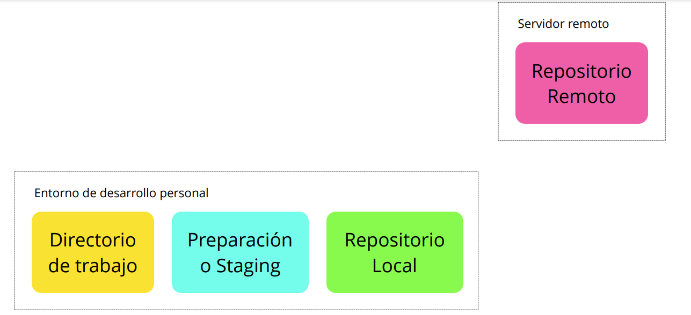
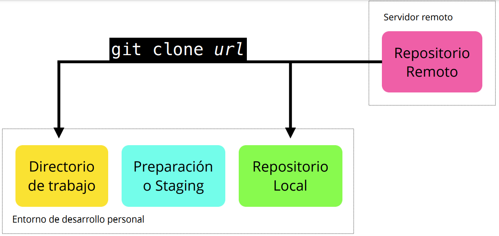
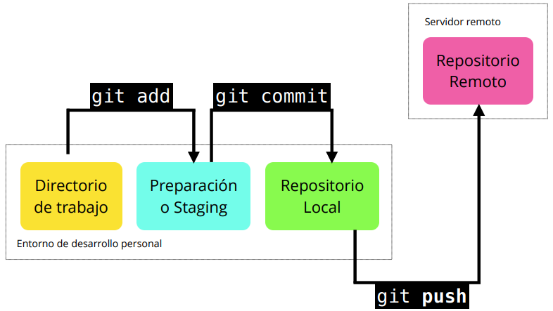
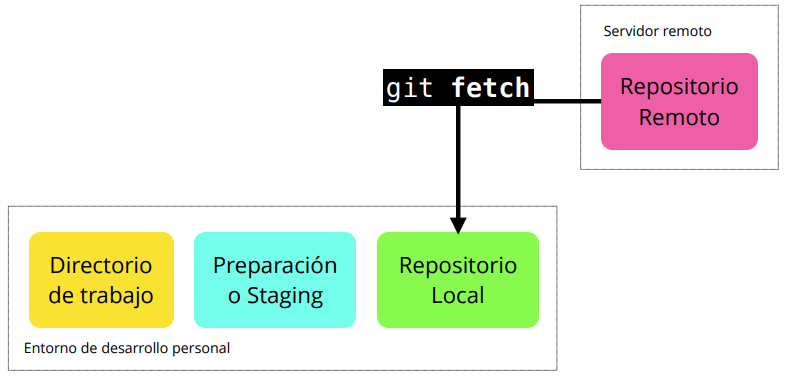
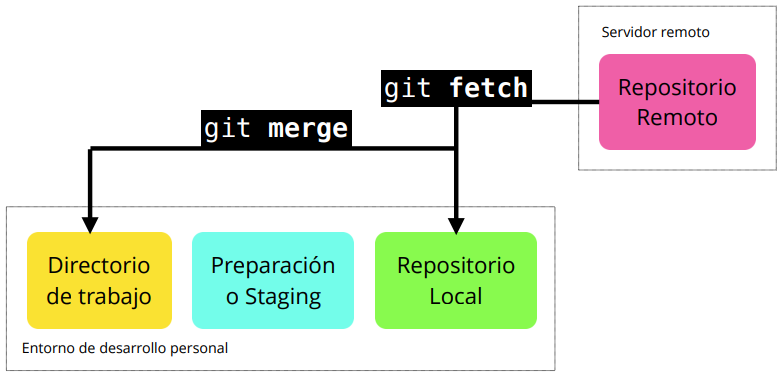
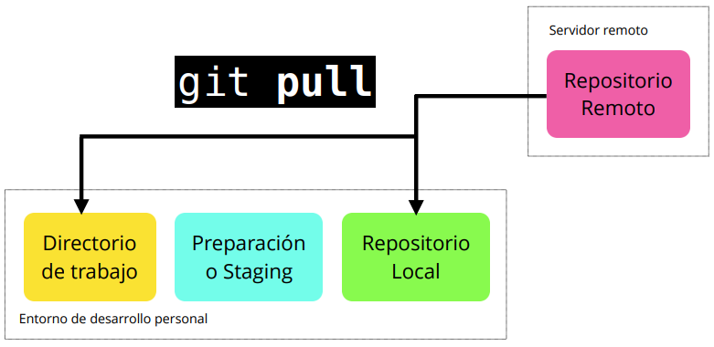

<div align="center">
  <h1>CURSO PROFESIONAL DEL GIT Y GITHUB</h1>
</div>

<div align="center" style="margin-bottom:20px;"> 
  
</div>


# Introducción a Git 
Es un sistema de control de versiones encargado de guardar el historial de cambios y crecimiento de los archivos de nuestro proyecto.

Git nos ayuda a llevar un control en las actualizaciones de nuestro proyecto, de esta manera no tenemos que estar creando un nuevo proyecto por cada cambio que queramos hacer.

También gracias a él prodemos tener colaboradores o colaborar en diferentes proyectos

Podemos saber que sucedió en la historia de todo el proyecto, quien realizo un cambio o un error.

<div style="margin-bottom:50px;"></div>

## Recuerda 
___
> Git y GitHub NO son lo mismo 

**Git** es un software para el control de versiones de archivos

**GitHub** es más bien como una red social de programadores, es el lugar donde puedes mostrar tus trabajos y colaborar.

<div style="margin-bottom:50px;"></div>

# Tabla de contenido
1. [Configurar Git](#configurar-git)
2. Comandos de Git
    - [Comandos básicos](#comandos-basicos-de-git)
    - [Comandos cambios en los archivos](#comandos-cambios-en-los-archivos)
    - [Comandos mover archivos entre estados](#comandos-mover-archivos-entre-estados)
    - [Comandos crear branch y hacer merge](#comandos-crear-branch-y-hacer-merge)
    - [Comandos volver en el tiempo un repositorio](#comandos-volver-en-el-tiempo-un-repositorio)
    - [Comandos Git reset vs Git rm](#git-reset-vs-git-rm)
    - [Comandos trabajo remoto con GIT](#comandos-para-trabajo-remoto-con-git)
    - [Comandos iniciales para Github](#comandos-iniciales-para-github)
    - [Comandos y recursos colaborativos en Git y GitHub](#comandos-iniciales-para-github)

3. [¿Qué es el staging?](#staging)
4. [Ramas o Branches en git](#branch)
5. [Flujo de trabajo básico con un repositorio remoto](#flujo-de-trabajo-con-un-repositorio-remoto)
6. [GitHub](#github)
7. [Configura tus llaves SSH en local](#configura-tus-llaves-ssh-en-local)
8. [Tags y versiones en Git y GitHub](#tags-y-versiones-en-git-y-github)
9. [Colaboradores en Github](#colaboradores-en-github)
10. [Pull requests](#pull-requests)
11. [Utilizando Pull Requests en GitHub](#utilizando-pull-requests-en-github)
12. [Git ignore](#git-ignore)
13. [Readme.md](#readme)
14. [GitHub Pages](#github-pages)
15. [Git Rebase](#git-rebase)
16. [Git Stash](#git-stash)
17. [Git Clean](#git-clean)
18. [Git cherry-pick](#git-cherry-pick)
19. [Git Reset y Reflog](#git-reset-y-reflog)
20. [Remendar un commit](#remendar-un-commit)
21. [Buscar en archivos y commits de Git](#buscar-en-archivos-y-commits-de-git)

<div style="margin-bottom:50px;"></div>

# Configurar Git
Este proceso solo se realiza una vez en el computador, son variables de entorno de git para que reconozca quien hace los commits.

* ***git config***: todas las configuraciones posibles que tiene git.

```bash
git config
```

* ***git config --list***: todas las configuraciones por defecto ya realizadas en git.

```bash
git config --list
```

* ***git config --list --show-origin***: para mostrar las configuraciones y sus rutas

```bash
git config --list --show-origin
```

* ***git config --global user.name***: para cambiar el nombre global de la configuración

```bash
git config --global user.name "Tu Nombre"
```

* ***git config --global user.email***: para cambiar el email global de la configuración

```bash
git config --global user.email "tu@email.com"
```
>Si por algún motivo te equivocaste en el nombre o email que configuraste al principio, lo puedes modificar de la siguiente manera:

```bash
git config --global --replace-all user.name “Aquí va tu nombre modificado”
```
>O si lo deseas eliminar y añadir uno nuevo
```bash
git config --global --unset-all user.name :Elimina el nombre del usuario
```
```bash
git config --global --add user.name “Aquí va tu nombre”
```

<div style="margin-bottom:50px;"></div>

# Comandos básicos de git

* ***git init***: inicializa un repositorio de GIT en la carpeta donde se ejecute el comando.

```bash
git init
```    
Recuerda que al ejecutar este comando (y de aquí en adelante) vamos a tener una nueva carpeta oculta llamada .git con toda la base de datos con cambios atómicos en nuestro proyecto. 
> Si quieres ver los archivos ocultos de una carpeta puedes ejecutar el comando ls -al

* ***git status***: ver el estado, si se requiere agregar al starget o si se requiere commit.

```bash
git status
``` 

* ***git add***: enviar un archivo especifico al staged.

```bash
git add nombre_del_archivo.txt
``` 

* ***git add .***: enviar todos los archivos con cambios al staged.

```bash
git add .
``` 

> Si nos equivocamos de archivo podemos sacarlo del staged con el siguiente comando...

* ***git rm --cached***: para eliminar el archivo del staged(ram), cuando no se ha realizado commit sino solo add.

```bash
git rm --cached nombre_archivo.txt
``` 

* ***git commit -m 'mensaje'***: se usa para añadir un commit a nuestra rama, también podemos ponerle un -m seguidamente ponemos entre comillas nuestro mensaje.

```bash
git commit -m 'mensaje'
``` 
* ***git commit -am'mensaje'***: Para crear commits rápidamente, fusionando git add y git commit -m ""

```bash
git commit -am 'mensaje'
``` 

* ***git log***: se usa para ver la historia de nuestros archivos, los commits, el usuario que lo cambió, cuando se realizaron los cambios etc. seguidamente ponemos el nombre de nuestro archivo.

```bash
git log nombre_archivo.txt
``` 

* ***git log --stat***: los cambios especificos en cada archivo, según el commit

```bash
git log --stat
```

<div style="margin-bottom:50px;"></div>

# Comandos cambios en los archivos
Estos comandos sirven para ver los cambios de cada archivo

* ***git show***: nos muestra los cambios que han existido sobre un archivo y es muy útil para detectar cuándo se produjeron ciertos cambios, qué se rompió y cómo lo podemos solucionar.

```bash
git show nombre_archivo.txt
``` 

* ***git diff***: ver la diferencia entre una versión y otra, no necesariamente todos los cambios desde la creación del archivo

```bash
git diff commitA commitB
``` 
<div style="margin-bottom:50px;"></div>

# Comandos mover archivos entre estados
Los estados de un archivo son 4

1. Untracket
2. Unstaged
3. Tracked
4. Staged

* ***git status***: nos permite ver el estado de todos nuestros archivos y carpetas.

```bash
git status
``` 
* ***git add***: nos ayuda a mover archivos del untracked o unstaged al estado staged.

```bash
git add
```

* ***git reset HEAD***: Nos ayuda a sacar archivos del estado staged para devolverlos a su estado anterior. Si los archivos venían de unstaged, vuelven allí. Y lo mismo se venían de untracked.

```bash
git reset HEAD
```

* ***git commit***: Nos ayuda a mover archivos de unstaged a tracked.

```bash
git commit -m "mensaje"
```

* ***git rm --cached***: mueve los archivos que le indiquemos al estado untracked.

```bash
git rm --cached
```

* ***git rm --force***: elimina los archivos de git y del disco duro. Git guarda el registro de la existencia de los archivos, por lo que podremos recuperarlos si es necesario (pero debemos usar comandos más avanzados).

```bash
git rm --force
```

<div style="margin-bottom:50px;"></div>

# Comandos crear branch y hacer merge

* ***git branch***: permite crear una rama nueva.

```bash
git branch new_branch
```

* ***git checkout***: para cambiar a una rama en especifico

```bash
git checkout new_branch
```

>Solo ten en cuenta que combinar estas ramas (hacer “merge”) puede generar conflictos. Algunos archivos pueden ser diferentes en ambas ramas. Git es muy inteligente y puede intentar unir estos cambios automáticamente, pero no siempre funciona. En algunos casos, somos nosotros los que debemos resolver estos conflictos a mano.

<div style="margin-bottom:50px;"></div>

# Comandos volver en el tiempo un repositorio

Para volver a commits previos, borrando los cambios realizados desde ese commit, podemos utilizar:

* ***git reset --soft***: elimina toda la información de cambios que has hecho a tu archivo pero lo que tenias en __staging__ se mantiene ahí dándote la posibilidad de aplicar los cambios.

```bash
git reset ID-del-commit --soft
```

* ***git reset --hard***: elimina toda la información de cambios que has hecho a tu archivo incluso el staging.

```bash
git reset ID-del-commit --hard
```


<div style="margin-bottom:20px;"></div>

* ***git checkout***: vuelve a la versión especificada sin borrar el historial del archivo.

```bash
git checkout ID-del-commit nombre_archivo
```
```bash
git checkout nombre_rama nombre_archivo
```

<div style="margin-bottom:50px;"></div>

# Comandos y recursos colaborativos en Git y GitHub

* ***git shortlog -sn***: muestra cuantos commit han hecho cada miembro del equipo.

```bash
git shortlog -sn
```

* ***git shortlog -sn --all***: muestra cuantos commit han hecho cada miembro del equipo, hasta los que han sido eliminados.

```bash
git shortlog -sn --all
```

* ***git shortlog -sn --all --no-merge***: muestra cuantos commit ha hecho cada miembro, quitando los eliminados sin los merges.

```bash
git shortlog -sn --all --no-merge
```

* ***git blame ARCHIVO***: muestra quien hizo cada cosa línea por línea.

```bash
git blame ARCHIVO
```

* ***git COMANDO --help***: muestra como funciona el comando.

```bash
git COMANDO --help
```

* ***git blame ARCHIVO -Llinea_inicial,linea_final***:  muestra quien hizo cada cosa línea por línea, indicándole desde qué línea ver. Ejemplo -L35,50

```bash
git blame ARCHIVO -L35,50
```

* ***git branch -r***: se muestran todas las ramas remotas.

```bash
git branch -r
```

* ***git branch -a***:  se muestran todas las ramas, tanto locales como remotas.

```bash
git branch -a
```

<div style="margin-bottom:50px;"></div>

# Git reset vs Git rm
Git reset y git rm son comandos con utilidades muy diferentes, pero se pueden confundir muy fácilmente.



<div style="margin-bottom:20px;"></div>

## Git rm
---
Este comando nos ayuda a eliminar archivos de Git sin eliminar su historial del sistema de versiones. Esto quiere decir que si necesitamos recuperar el archivo solo debemos “viajar en el tiempo” y recuperar el último commit antes de borrar el archivo en cuestión.

>Recuerda que git rm no puede usarse así nomás. Debemos usar uno de los flags para indicarle a Git cómo eliminar los archivos que ya no necesitamos en la última versión del proyecto.

* ***git rm --cached***: Elimina los archivos de nuestro repositorio local y del área de staging, pero los mantiene en nuestro disco duro.

```bash
git rm --cached nombre_archivo.txt
```

* ***git rm --force***: Elimina los archivos de Git y del disco duro.

```bash
git rm --force nombre_archivo.txt
```

## Git reset
---
Este comando nos ayuda a volver en el tiempo. Pero no como git checkout que nos deja ir, mirar, pasear y volver. Con git reset volvemos al pasado sin la posibilidad de volver al futuro. Borramos la historia y la debemos sobreescribir. No hay vuelta atrás.

>Este comando es muy peligroso y debemos emplearlo solo en caso de emergencia.

* ***git reset --soft***: elimina toda la información de cambios que has hecho a tu archivo pero lo que tenias en __staging__ se mantiene ahí dándote la posibilidad de aplicar los cambios.

```bash
git reset ID-del-commit --soft
```

* ***git reset --hard***: elimina toda la información de cambios que has hecho a tu archivo incluso el staging.

```bash
git reset ID-del-commit --hard
```

* ***git reset HEAD***: Este es el comando para sacar archivos del área de staging. No para borrarlos ni nada de eso, solo para que los últimos cambios de estos archivos no se envíen al último commit.

```bash
git reset HEAD nombre_archivo.txt
```

* ***git reset --mixed***: restablece el índice, pero no el árbol de trabajo e informa de lo que no ha sido actualizado

```bash
git reset --mixed nombre_archivo.txt
```


<div style="margin-bottom:50px;"></div>

# Staging


<div style="margin-bottom:20px;"></div>

**El staging** es el lugar donde se guardan temporalmente los cambios, para luego ser llevados definitivamente al repositorio, este espacio esta en la memoria RAM de nuestra computadora. 

**El repositorio** es el lugar donde se guardan todos los registros de los cambios realizados a los archivos.

**.git** es donde se guarda el historial de cambios de nuestros archivos

>En git existen cuatro estados para los archivos

1. **Untracket:** Son archivos que NO viven dentro de git, solo en el disco duro. Nunca han sido afectados por __git add__, así que git no tiene registros de su existencia.
2. **Unstaged:** Son archivos que viven dentro de git pero no han sido afectados por el comando __git add__ ni mucho menos por __git commit__. Git tiene un registro de estos archivos, pero está desactualizado, sus últimas versiones solo están guardadas en el disco duro.
3. **Staged:** Son archivos en staging. Viven dentro de git y hay registro de ellos porque han sido afectados por el comando __git add__, aunque no sus últimos cambios. Git ya sabe de la existencia de estos últimos cambios, pero todavía no han sido guardados definitivamente en el repositorio porque falta ejecutar el comando __git commit__.
4. **Tracket:** Son los archivos que viven dentro de git, no tienen cambios pendientes y sus últimas actualizaciones han sido guardadas en el repositorio gracias a los comandos __git add__ y __git commit__

>Recuerda que hay un caso muy raro donde los archivos tienen dos estados al mismo tiempo: staged y untracked. Esto pasa cuando guardas los cambios de un archivo en el área de staging (con el comando git add), pero antes de hacer commit para guardar los cambios en el repositorio haces nuevos cambios que todavía no han sido guardados en el área de staging.

<div style="margin-bottom:50px;"></div>

# Branch 
Una **rama** o **branch** es una versión del código del proyecto sobre el que estás trabajando. Estas ramas ayudan a mantener el orden en el control de versiones y manipular el código de forma segura.

En otras palabras, un branch o rama en Git es una rama que proviene de otra. Imagina un árbol, que tiene una rama gruesa, y otra más fina, en la rama más gruesa tenemos los commits principales y en la rama fina tenemos otros commits que pueden ser de hotfix, devlopment entre otros.ㅤ


<div style="margin-bottom:20px;"></div>

## Clases de branches o ramas en Git
---
Estas son las ramas base de un proyecto en Git:

1. **Rama main (Master):** Por defecto, el proyecto se crea en una rama llamada Main (anteriormente conocida como Master).

2. **Rama development:** Cuando decides hacer experimentos, puedes generar ramas experimentales (usualmente llamadas development), que están basadas en alguna rama main, pero sobre las cuales puedes hacer cambios a tu gusto sin necesidad de afectar directamente al código principal.

3. **Rama hotfix:** En otros casos, si encuentras un bug o error de código en la rama Main (que afecta al proyecto en producción), tendrás que crear una nueva rama (que usualmente se llaman bug fixing o hot fix) para hacer los arreglos necesarios.

>**Todos los commits se aplican sobre una rama.** Por defecto, siempre empezamos en la rama Main (pero puedes cambiarle el nombre si no te gusta) y generamos nuevas ramas, a partir de esta, para crear flujos de trabajo independientes.

* ***git branch***: permite crear una rama nueva.

```bash
git branch new_branch
```

* ***git checkout***: para cambiar a una rama en especifico

```bash
git checkout name_branch
```

* ***git checkout -b**: Genera una rama y nos mueve a ella automáticamente, Es decir, es la combinación de git brach y git checkout al mismo tiempo.

```bash
git checkout -b new_branch
```

* ***git reset**: Nos lleva a cualquier commit no importa la rama, ya que identificamos el id del tag, eliminando el historial de los commit posteriores al tag seleccionado.

```bash
git reset id-commit
```

* ***git checkout rama-o-id-commit**: nos lleva a cualquier commit sin borrar los commit posteriores al tag seleccionado.

```bash
git checkout rama-o-id-commit
```
> Recuerda que al ejecutar el comando git checkout para cambiar de rama o commit puedes perder el trabajo que no hayas guardado. Guarda siempre tus cambios antes de hacer git checkout.

> La cabecera o **HEAD** representan la rama y el commit de esa rama donde estamos trabajando. Por defecto, esta cabecera aparecerá en el último commit de nuestra rama principal.

* ***git branch -d**: eliminar una rama.

```bash
git branch -d
```
>  Desde el 1 de octubre de 2020 GitHub cambió el nombre de la rama principal: ya no es “master” -como aprenderás en el curso- sino main.

* ***git branch -M main**: -M = mueve todos los cambios existentes en tu rama master a la nueva rama main

```bash
git branch -M main
```

* ***git show-branch**: nos muestra las ramas que existen y su historia

```bash
git show-branch
```

* ***git show-branch --all**: nos muestra una información más amplia

```bash
git show-branch --all
```
* ***gitk**: fue el primer visor gráfico que se desarrolló para ver de manera gráfica el historial de un repositorio de Git.

```bash
gitk
```

> Este programa viene por defecto si se instala git bash en windows, en otro sistema operativo no viene preinstalado.

<div style="margin-bottom:50px;"></div>

# Flujo de trabajo con un repositorio remoto

Cuando empiezas a trabajar en un entorno local, el proyecto vive únicamente en tu computadora. Esto significa que no hay forma de que otros miembros del equipo trabajen en él.

Para solucionar esto, utilizamos los servidores remotos: un nuevo estado que deben seguir nuestros archivos para conectarse y trabajar con equipos de cualquier parte del mundo.

Estos servidores remotos pueden estar alojados en GitHub, GitLab, BitBucket, entre otros. Lo que van a hacer es guardar el mismo repositorio que tienes en tu computadora y darnos una URL con la que todos podremos acceder a los archivos del proyecto. Así, el equipo podrá descargarlos, hacer cambios y volverlos a enviar al servidor remoto para que otras personas vean los cambios, comparen sus versiones y creen nuevas propuestas para el proyecto.



<div style="margin-bottom:20px;"></div>

## Comandos para trabajo remoto con GIT

* ***git clone***: nos permite descargar los archivos de la última versión de la rama principal y todo el historial de cambios en la carpeta .git.

```bash
git clone url_del_servidor_remoto
```


<div style="margin-bottom:20px;"></div>

* ***git push***: luego de hacer git add y git commit debemos ejecutar este comando para mandar los cambios al servidor remoto.

```bash
git push
```



<div style="margin-bottom:20px;"></div>

* ***git fetch***: lo usamos para traer actualizaciones del servidor remoto y guardarlas en nuestro repositorio local (en caso de que hayan, por supuesto).

```bash
git fetch
```



<div style="margin-bottom:20px;"></div>


* ***git merge***: también usamos el comando git merge con servidores remotos. Lo necesitamos para combinar los últimos cambios del servidor remoto y nuestro directorio de trabajo.


```bash
git merge nombre_rama
```



<div style="margin-bottom:20px;"></div>

> Posicionarse en la rama donde queremos que se fusionen las ramas, casi siempre master

* ***git merge --abort***: si nos hemos equivocado y queremos cancelar el merge


```bash
git merge --abort
```

* ***git pull***: básicamente, git fetch y git merge al mismo tiempo.

```bash
git pull
```



<div style="margin-bottom:50px;"></div>


# GitHub  


Es una plataforma que nos permite guardar repositorios de Git que podemos usar como servidores remotos y ejecutar algunos comandos de forma visual e interactiva (sin necesidad de la consola de comandos).

Luego de crear nuestra cuenta, podemos crear o importar repositorios, crear organizaciones y proyectos de trabajo, descubrir repositorios de otras personas, contribuir a esos proyectos, dar estrellas y muchas otras cosas.


> **README.md** es el archivo que veremos por defecto al entrar a un repositorio. Es una muy buena práctica configurarlo para describir el proyecto, los requerimientos y las instrucciones que debemos seguir para contribuir correctamente.

## Comandos iniciales para GitHub

* ***git clone***: para clonar un repositorio desde GitHub (o cualquier otro servidor remoto).

```bash
git clone url_repositorio
```

> Sin embargo, esto solo funciona para las personas que quieren empezar a contribuir en el proyecto.

* ***git remote add origin***: guardar la URL del repositorio de GitHub con el nombre de origin

```bash
git remote add origin URL
```

* ***git remote remove origin***: elimina el origen generado del proyecto.

```bash
git remote remove origin
```

* ***git remote***: verificar que la URL se haya guardado correctamente.

```bash
git remote
```

```bash
git remote -v
```

* ***git pull origin main***: Traer la versión del repositorio remoto y hacer merge para crear un commit con los archivos de ambas partes. Podemos usar git fetch y git merge o solo git pull con el flag --allow-unrelated-histories

```bash
git pull origin main --allow-unrelated-histories
```

> Para salir de la consola de VIM ejecutar ESC+SHIF+Z+Z

* ***git push origin main***: para guardar los cambios de nuestro repositorio local en GitHub

```bash
git push origin main 
```

### Pasos para crear un token de acceso personal.
---

Desde el 2022 GitHub ya no deja hacer el push con la contraseña del propio GitHub, para esto tenemos que crear un token, y este token es la contraseña que vamos a colocar cuando nos pida clave

Seguir la secuencia: Ingresamos a nuestra cuenta de GitHub.

1. Buscamos Settings
2. Click en Developer settings
3. Click en Personal access tokens
4. Click en Generate new token aquí se puede colocar un nombre, la fecha de expiración.
5. Tildar en repo y luego click en el botón verde Generate token

<div style="margin-bottom:50px;"></div>

# Configura tus llaves SSH en local

La creación de las SSH es necesario solo una vez por cada computadora. Aquí conocerás cómo conectar a GitHub usando SSH. Es importante este tipo de cifrado para proteger aún más tu repositorio de github.

* ***ssh-keygen -t rsa -b 4096 -C***: Generar una nueva llave SSH: (Cualquier sistema operativo)

```bash
ssh-keygen -t rsa -b 4096 -C "youremail@example.com"
```

* ***eval $(ssh-agent -s)***: Encender el “servidor” de llaves SSH de tu computadora

```bash
eval $(ssh-agent -s)
```

* ***ssh-add ruta_archivo_privado***: Añadir tu llave SSH a este “servidor”

```bash
ssh-add ~/.ssh/id_rsa
```

## Conexión a GitHub con SSH
---

Luego de crear nuestras llaves SSH podemos entregarle la llave pública a GitHub para comunicarnos de forma segura y sin necesidad de escribir nuestro usuario y contraseña todo el tiempo.

Para esto debes entrar a la [Configuración de Llaves SSH en GitHub](https://github.com/settings/keys), crear una nueva llave con el nombre que le quieras dar y el contenido de la llave pública de tu computadora.

Ahora podemos actualizar la URL que guardamos en nuestro repositorio remoto, solo que, en vez de guardar la URL con HTTPS, vamos a usar la URL con SSH.

* ***ssh git remote set-url origin url-ssh-del-repositorio-en-github***: Añadir tu llave SSH a este “servidor”

```bash
ssh git remote set-url origin url_ssh_github
```

<div style="margin-bottom:50px;"></div>

# Tags y versiones en Git y GitHub
Los tags o etiquetas nos permiten asignar versiones a los commits con cambios más importantes o significativos de nuestro proyecto.

## Comandos para tags

* ***git tag -a***: crear un nuevo tag y asignarlo a un commit

```bash
git tag -a nombre-del-tag id-del-commit
```

* ***git tag***: listar los tags de nuestro repositorio local

```bash
git tag
```
```bash
git show-ref --tags
```

* ***git push origin --tags***: publicar un tag en el repositorio remoto

```bash
git push origin --tags
```

* ***git tag -d***: borrar un tag en el repositorio local

```bash
git tag -d nombre-del-tag
```

* ***git push origin :refs/tags/nombre-del-tag***: borrar un tag del repositorio remoto

> primero debe borrarse localmente

```bash
git push origin :refs/tags/nombre-del-tag
```

Para generar un comando complejo con varios comandos de una forma optimizada, utilizamos conjuntos de sentencias conocidas como alias.

* ***para un proyecto***

```bash
git config alias.arbolito "log --all --graph --decorate --oneline"
```

* ***global***

```bash
git config --global alias.arbolito "log --all --graph --decorate --oneline"
```

* ***para correrlo***
```bash
git arbolito
```

<div style="margin-bottom:50px;"></div>

# Colaboradores en Github

Por defecto, cualquier persona puede clonar o descargar tu proyecto desde GitHub, pero no pueden crear commits, ni ramas. Esto quiere decir que pueden copiar tu proyecto pero no colaborar con él. Existen varias formas de solucionar esto para poder aceptar contribuciones. Una de ellas es añadir a cada persona de nuestro equipo como colaborador de nuestro repositorio.

* Solo debemos entrar a la configuración de colaboradores de nuestro proyecto. Se encuentra en:
__Repositorio > Settings > Collaborators__

> Si, como colaborador, agregaste erróneamente el mensaje del commit, lo puedes cambiar de la siguiente manera:

* ***git commit —amend***: hacer un commit con el nuevo mensaje que queremos, esto nos abre el editor de texto de la terminal

```bash
git commit —amend
```

* ***git push --set-upstream origin master
***: ejecutar el cambio


```bash
git push --set-upstream origin master
```

<div style="margin-bottom:50px;"></div>

# Pull requests

En un entorno profesional normalmente se bloquea la rama master, y para enviar código a dicha rama pasa por un code review y luego de su aprobación se unen códigos con los llamados merge request.

Para realizar pruebas enviamos el código a servidores que normalmente los llamamos staging develop (servidores de pruebas) luego de que se realizan las pruebas pertinentes tanto de código como de la aplicación estos pasan al servidor de producción con el ya antes mencionado merge request.

Los PR (pull requests) son la base de la colaboración a proyectos Open Source, si tienen pensando colaborar en alguno es muy importante entender esto y ver cómo se hace en las próximas clases. Por lo general es forkear el proyecto, implementar el cambio en una nueva rama, hacer el PR y esperar que los administradores del proyecto hagan el merge o pidan algún cambio en el código o commits que hiciste.


<div style="margin-bottom:20px;"></div>

## Proceso de un pull request para trabajo en producción:

* Un pull request es un estado intermedio antes de enviar el merge.

* El pull request permite que otros miembros del equipo revisen el código y así aprobar el merge a la rama.

* Permite a las personas que no forman el equipo, trabajar y colaborar con una rama.

* La persona que tiene la responsabilidad de aceptar los pull request y hacer los merge tienen un perfil especial y son llamados DevOps

> Los **pull request** es una funcionalidad de GitHub no de Git

<div style="margin-bottom:50px;"></div>

# Utilizando Pull Requests en GitHub

Pull request es una funcionalidad de Github (en Gitlab llamada merge request y en Bitbucket push request), en la que un colaborador pide que revisen sus cambios antes de hacer merge a una rama, normalmente master (ahora conocida como main).

Al hacer un pull request, se genera una conversación que pueden seguir los demás usuarios del repositorio, así como autorizar y rechazar los cambios.

1. Se trabaja en una rama paralela los cambios que se desean git checkout -b <rama>.

2. Se hace un commit a la rama git commit -am '<Comentario>'.

3. Se suben al remoto los cambios git push origin <rama>.

4. En GitHub se hace el pull request comparando la rama master con la rama del fix.

5. Uno, o varios colaboradores revisan que el código sea correcto y dan feedback (en el chat del pull request).

6. El colaborador hace los cambios que desea en la rama y lo vuelve a subir al remoto (automáticamente jala la historia de los cambios que se hagan en la rama, en remoto).

7. Se aceptan los cambios en GitHub.

8. Se hace merge a master desde GitHub.

<div style="margin-bottom:50px;"></div>

# Creando un Fork, contribuyendo a un repositorio

Los forks o bifurcaciones son una característica única de GitHub en la que se crea una copia exacta del estado actual de un repositorio directamente en GitHub. Este repositorio podrá servir como otro origen y se podrá clonar (como cualquier otro repositorio). En pocas palabras, lo podremos utilizar como un nuevo repositorio git cualquiera

Al hacer un fork de un proyecto en GitHub, te conviertes en dueñ@ del repositorio fork, puedes trabajar en este con todos los permisos, pero es un repositorio completamente diferente que el original, teniendo solamente alguna historia en común (como crédito al creado o creadora original).

Los forks son importantes porque es la manera en la que funciona el open source, ya que, una persona puede no ser colaborador de un proyecto, pero puede contribuír al mismo, haciendo mejor software que pueda ser utilizado por cualquiera.

## Cómo se hace un fork remoto desde consola en GitHub

Al hacer un fork, GitHub sabe que se hizo el fork del proyecto, por lo que se le permite al colaborador hacer pull request desde su repositorio propio.

Cuando trabajas en un proyecto que existe en diferentes repositorios remotos (normalmente a causa de un fork), es muy probable que desees poder trabajar con ambos repositorios. Para esto, puedes generar un remoto adicional desde consola.

* ***git remote add <nombre_del_remoto> <url_del_remoto>***: crear un nuevo repositorio remoto para tener vinculado el proyecto oficial.

```bash
git remote upstream <url_del_remoto>
```

> el remoto origin se utiliza para el local de nuestro github

* ***git pull <remoto> <rama>***: al crear un remoto adicional, podremos hacer pull desde el nuevo origen.

```bash
git pull upstream master
```

<div style="margin-bottom:50px;"></div>

# Git ignore

No todos los archivos que agregas a un proyecto deberían ir a un repositorio. Por ejemplo, cuando tienes un archivo donde están tus contraseñas que comúnmente tienen la extensión .env o cuando te estás conectando a una base de datos; son archivos que nadie debe ver.

```bash
touch .gitignore
```

> Ejemplos de gitignore https://www.toptal.com/developers/gitignore


<div style="margin-bottom:50px;"></div>

# Readme

Es el lugar donde se explica de qué trata el proyecto, cómo utilizarlo y demás información que se considere que se deba conocer cualquier persona que vaya a trabajar de alguna forma con el proyecto.

Los archivos README son escritos en un lenguaje llamado markdown, por eso la extensión .md, mismo que es un estándar de escritura en diversos sitios (como Platzi, Wikipedia y el mismo GitHub). [Aquí puedes ver las reglas de markdown.](https://www.markdownguide.org/extended-syntax)

> Un editor online: https://pandao.github.io/editor.md/en.html

> Emojis para el README https://www.webfx.com/tools/emoji-cheat-sheet/

<div style="margin-bottom:50px;"></div>

# GitHub Pages

GitHub tiene un servicio de hosting gratis llamado GitHub Pages. Con él, puedes tener un repositorio alojado en GitHub y hacer que el contenido se muestre en la web en tiempo real.

> https://pages.github.com/

1. Debemos tomar la llave SSH y hacer un git clone #SSHexample en mi computador local (Home).

2. Luego, accederemos a la carpeta nueva que aparece en nuestra máquina local.

3. Creamos un nuevo archivo que se llame index.html

4. Guardamos los cambios, hacemos un git pull y seguido de esto un git push a master.

5. Vamos a las opciones de settings de este repositorio y, en la parte de abajo, en la columna Github Pages, configuramos el source o fuente para que traiga la rama master.

6. Guardamos los cambios.


<div style="margin-bottom:50px;"></div>

# Git Rebase
Rebase es el proceso de mover o combinar una secuencia de confirmaciones en una nueva confirmación base. La reorganización es muy útil y se visualiza fácilmente en el contexto de un flujo de trabajo de ramas de funciones. El proceso general se puede visualizar de la siguiente manera.


<div style="margin-bottom:20px;"></div>

Para hacer un rebase en la rama feature de la rama master, correrías los siguientes comandos:

```bash
git checkout feature
```

```bash
git rebase master
```

Esto trasplanta la rama feature desde su locación actual hacia la punta de la rama master:


<div style="margin-bottom:20px;"></div>

Ahora, falta fusionar la rama feature con la rama master

```bash
git checkout master
```

```bash
git rebase feature
# No reorganices el historial público
```

> El comando rebase es **una mala práctica**, sobre todo en repositorios remotos. Se debe evitar su uso, pero para efectos de práctica te lo vamos a mostrar, para que hagas tus propios experimentos. Con rebase puedes recoger todos los cambios confirmados en una rama y ponerlos sobre otra.


<div style="margin-bottom:50px;"></div>

# Git Stash
El stashed nos sirve para guardar cambios para después, Es una lista de estados que nos guarda algunos cambios que hicimos en Staging para poder cambiar de rama o branch sin perder el trabajo que todavía no guardamos en un commit

Ésto es especialmente útil porque hay veces que no se permite cambiar de rama, ésto porque tenemos cambios sin guardar, no siempre es un cambio lo suficientemente bueno como para hacer un commit, pero no queremos perder ese código en el que estuvimos trabajando.

* ***git stash***: Para agregar los cambios al stash se utiliza el comando

```bash
git stash
```

* ***git stash list***: Para ver la lista de cambios guardados en Stash y así poder recuperarlos o hacer algo con ellos podemos

```bash
git stash list
```

* ***git stash save 'mensaje'***: Podemos poner un mensaje en el stash, para asi diferenciarlos en git stash list por si tenemos varios elementos en el stash

```bash
git stash save "mensaje"
```

* ***git stash save 'mensaje'***: Podemos poner un mensaje en el stash, para asi diferenciarlos en git stash list por si tenemos varios elementos en el stash

```bash
git stash save "mensaje"
```

> El stashed se comporta como una Stack de datos comportándose de manera tipo LIFO (del inglés Last In, First Out, «último en entrar, primero en salir»), así podemos acceder al método pop.

* ***git stash pop***: Para recuperar los últimos cambios desde el stash a tu staging area utiliza el comando

```bash
git stash pop
```

* ***git stash pop stash@{<num_stash>}***: Para aplicar los cambios de un stash específico y eliminarlo del stash

```bash
git stash pop stash@{<num_stash>}
```

* ***git stash apply stash@{<num_stash>}***: Para retomar los cambios de una posición específica del Stash puedes utilizar el comando

```bash
git stash apply stash@{<num_stash>}
```

* ***git stash branch <nombre_de_la_rama>***: Para crear una rama y aplicar el stash más reciente podemos utilizar el comando.

```bash
git stash branch <nombre_de_la_rama>
```

* ***git stash branch nombre_de_rama stash@{<num_stash>}***: Si deseas crear una rama y aplicar un stash específico (obtenido desde git stash list) puedes utilizar el comando.

```bash
git stash branch nombre_de_rama stash@{<num_stash>}
```

* ***git stash drop***: Para eliminar los cambios más recientes dentro del stash (el elemento 0), podemos utilizar el comando

```bash
git stash drop
```

* ***git stash drop stash@{<num_stash>}***: pero si, en cambio, conoces el índice del stash que quieres borrar (mediante git stash list) puedes utilizar el comando

```bash
git stash drop stash@{<num_stash>}
```

* ***git stash clear***: eliminar todos los elementos del stash

```bash
git stash clear
```

<div style="margin-bottom:50px;"></div>

# Git Clean

limpiar tu proyecto de archivos no deseados

Mientras estamos trabajando en un repositorio podemos añadir archivos a él, que realmente no forma parte de nuestro directorio de trabajo, archivos que no se deberían de agregar al repositorio remoto.

El comando clean actúa en archivos sin seguimiento, este tipo de archivos son aquellos que se encuentran en el directorio de trabajo, pero que aún no se han añadido al índice de seguimiento de repositorio con el comando add.

* ***git clean***: eliminar todos los elementos del stash

```bash
git clean
```

La ejecución del comando predeterminado puede producir un error. La configuración global de Git obliga a usar la opción force con el comando para que sea efectivo. Se trata de un importante mecanismo de seguridad ya que este comando no se puede deshacer.

* ***git clean --dry-run***: revisar que archivos no tienen seguimiento.

```bash
git clean --dry-run
```

* ***git clean -f***: eliminar los archivos listados de no seguimiento.

```bash
git clean -f
```

* ***git clean -df***: el parametro -d ayuda con el borrado de carpetas untracked.

```bash
git clean -df
```

<div style="margin-bottom:50px;"></div>

# Git cherry-pick

es un comando que permite tomar uno o varios commits de otra rama o branch sin tener que hacer un merge completo. Así, gracias a cherry-pick, podríamos aplicar los commits relacionados con nuestra funcionalidad en la rama master sin necesidad de hacer un merge.

* ***git checkout main***: pasarnos a la rama main

```bash
git checkout main
```

* ***git cherry-pick f***: fusionar con la rama main

```bash
git cherry-pick f
```

> Cherry-pick es una mala práctica porque significa que estamos reconstruyendo la historia, usa cherry-pick con sabiduría. Si no sabes lo que estás haciendo, mejor evita emplear este comando.

<div style="margin-bottom:50px;"></div>

# Git Reset y Reflog

Git guarda todos los cambios aunque decidas borrarlos, al borrar un cambio lo que estás haciendo sólo es actualizar la punta del branch, para gestionar éstas puntas existe un mecanismo llamado registros de referencia o reflogs…La gestión de estos cambios es mediante los hash’es de referencia (o ref) que son apuntadores a los commits…Los recoges registran cuándo se actualizaron las referencias de Git en el repositorio local (sólo en el local), por lo que si deseas ver cómo has modificado la historia puedes utilizar el comando:

```bash
git reflog
```

* ***git reset --soft HashDelHEAD***:  te mantiene lo que tengas en staging ahí.

```bash
git reset --soft HashDelHEAD
```

* ***git reset --hard HashDelHEAD***:  resetea absolutamente todo incluyendo lo que tengas en staging.

```bash
git reset --hard HashDelHEAD
```

> git reset es una mala práctica, no deberías usarlo en ningún momento. Debe ser nuestro último recurso.

<div style="margin-bottom:50px;"></div>

# Remendar un commit

Remendar un commit con amend puede modificar el commit más reciente (enmendar) en la misma rama. Lo ejecutamos así:

```bash
git add -A # Para hacer uso de amend los archivos deben de estar en staging
```

```bash
git commit --amend # Remendar último commit
```

Este comando sirve para agregar archivos nuevos o actualizar el commit anterior y no generar commits innecesarios. También es una forma sencilla de editar o agregar comentarios al commit anterior porque abrirá la consola para editar este commit anterior.

> Usar amend es una mala práctica, sobre todo cuando ya se ha hecho push o pull al repositorio remoto. Al momento de hacer amend con algún commit que esté en remoto, va a generar un conflicto que se va a arreglar haciendo un commit adicional y se perderá el beneficio del amend.

<div style="margin-bottom:50px;"></div>

# Buscar en archivos y commits de Git

A medida que nuestro proyecto en Git se hace más grande, vamos a querer buscar ciertas cosas.

* ***git grep <palabra>*** nos buscará en todo el proyecto los archivos en donde está la palabra escrita

```bash
git grep <palabra>
```

* ***git grep -n <palabra>*** nos saldrá un output el cual nos dirá en qué línea está lo que estamos buscando.

```bash
git grep -n <palabra>
```

* ***git grep -c <palabra>*** nos saldrá un output el cual nos dirá cuántas veces se repite esa palabra y en qué archivo.

```bash
git grep -c <palabra>
```

* ***git log -S <palabra>*** cuantas veces use la palabra en
todos los commits.

```bash
git log -S <palabra>
```